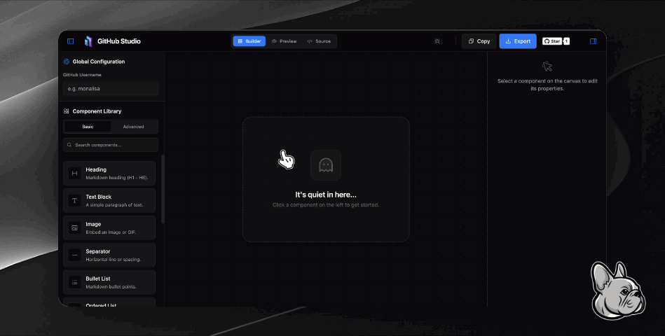

`I'm Chris, a Full-Stack Developer.`

👨🏻‍💻 Currently working at an AIGC startup.

🎸 An amateur guitarist.

🐶 I have a Frenchie named Tiantong.

🤝 Always open to new opportunities.

😃 Enjoy building and sharing within the open-source community.

  &nbsp;&nbsp;&nbsp;&nbsp;
  &nbsp;&nbsp;&nbsp;&nbsp;
  &nbsp;&nbsp;&nbsp;&nbsp;
  

## What I've Built

  
  &nbsp;&nbsp;&nbsp;
  

  
  &nbsp;&nbsp;&nbsp;
  

## Keep building

  <!--
  
  -->
  
  &nbsp;&nbsp;
  <!--  -->

## Funny game

<!-- <picture>
  <source media="(prefers-color-scheme: dark)" srcset="https://github.com/kangchainx/kangchainx/blob/output/github-snake-dark.svg" />
  <source media="(prefers-color-scheme: light)" srcset="https://github.com/kangchainx/kangchainx/blob/output/github-snake.svg" />
  
</picture> -->

<!-- 

  

 -->
